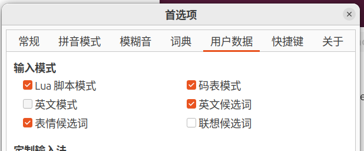

# ibus input method
## 1. ibus中文输入法，键盘输入v的时候，会自动切英文模式。
如果我敲入“vscode”，实际打出来的是"scode"。这个很不符合平时的使用习惯。
关闭v自动切换英文模式的方式：不勾选“英文模式”  


## 2. ibus输入法在文件夹中重命名一个文件或这文件夹，不能输入中文名。
需要在～/.profile中添加ibus的环境设置：
```
#ibut input env setting for GTK(Gnome), X11, QT
export GTK_IM_MODULE=ibus
export XMODIFIERS=@im=ibus
export QT_IM_MODULE=ibus
```
* 因为.profile是login的时候执行，用于设置环境变量 (如 JAVA_HOME, PATH, EDITOR)。这样所有程序（包括从图形界面启动的程序）都能访问到。如果放到.bashrc里，就只有新起的terminal里会有这个设置，图形界面中不会有。
* .profile只在login的时候执行一次，修改.profile后，需要source .profile或者logout再login才会其作用。

## 3. 