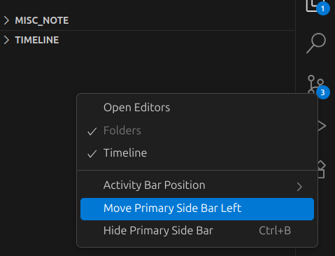
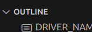
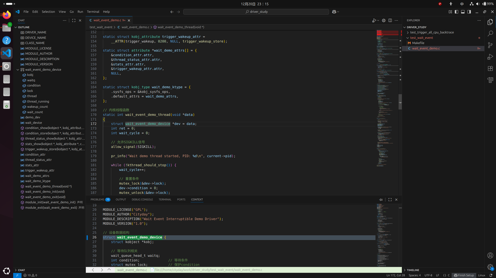
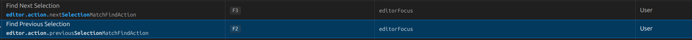

# 记录vscode使用中的问题
## 将vscode设置成source insight一样的布局
* step1. 安装插件： contex window。 这样鼠标放到某个symbol之后，在下面显示symbol具体的实现。
* step2. 设定primary side bar 显示到右侧。目的是在右侧显示文件

* step3. 鼠标放在outline旁边，当鼠标变成一个小手样子时，拖拽outline到左侧secondary side bar。目的是左侧显示symbol

最后的效果如下：

## 设置vscode editor中查找上一个/下一个快捷键为F2和F3

